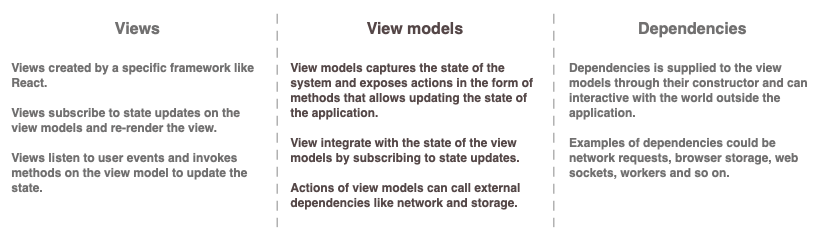

# @view-models/core

[](https://github.com/sunesimonsen/view-models-core/actions/workflows/ci.yml)
[](https://unpkg.com/@view-models/core@latest/dist/index.js)

A lightweight, framework-agnostic library for building reactive view models with
TypeScript. Separate your business logic from your UI framework with a simple,
testable pattern.



## Why View Models?

- **Framework Agnostic**: Write your logic once, use it with React, Preact, or any other framework
- **Easy Testing**: Test your view logic without rendering anything to the DOM
- **Simple API**: Just extend `ViewModel` and you're ready to go
- **Type Safe**: Built with TypeScript for excellent IDE support
- **Minimal Boilerplate**: Much lighter than Redux with no reducers, actions, or middleware needed
- **Natural Organization**: A clear place to put your application logic

## Installation

```bash
npm install @view-models/core
```

## Quick Start

Define your state type and extend `ViewModel`:

```typescript
import { ViewModel } from "@view-models/core";

type CounterState = {
  count: number;
};

class CounterViewModel extends ViewModel<CounterState> {
  constructor() {
    super({ count: 0 });
  }

  increment = () => {
    super.update({
      count: super.state.count + 1,
    });
  };

  decrement = () => {
    super.update({
      count: super.state.count - 1,
    });
  };
}
```

Use it in your tests:

```typescript
import { describe, it, expect } from "vitest";

describe("CounterViewModel", () => {
  it("increments the counter", () => {
    const counter = new CounterViewModel();

    counter.increment();
    expect(counter.state.count).toBe(1);

    counter.increment();
    expect(counter.state.count).toBe(2);
  });

  it("notifies subscribers on updates", () => {
    const counter = new CounterViewModel();
    const updates = [];

    counter.subscribe(() => updates.push(counter.state));

    counter.increment();
    counter.increment();

    expect(updates).toEqual([{ count: 1 }, { count: 2 }]);
  });
});
```

## Examples

- [TodoMVC using @view-models/react](https://github.com/sunesimonsen/view-models-react-todomvc)
- [HackerNews using @view-models/react](https://github.com/sunesimonsen/view-models-react-hackernews)

## Framework Integration

The view models are designed to work with framework-specific adapters. Upcoming
adapters include:

- [@view-models/react](https://github.com/sunesimonsen/view-models-react) - React hooks integration
- [@view-models/preact](https://github.com/sunesimonsen/view-models-preact) - Preact hooks integration

These adapters will allow you to use the same view model with different frameworks:

```typescript
// Coming soon with @view-models/react
function Counter({ model }) {
  const { count } = useModelState(model);

  return (
    <div>
      <p>Count: {count}</p>
      <button onClick={model.increment}>+</button>
      <button onClick={model.decrement}>-</button>
    </div>
  );
}
```

## API Reference

For detailed API documentation, see [docs](./docs).

## Patterns and Best Practices

### Keep State Immutable

Always return new state objects from your updater functions:

```typescript
// Good
super.update({
  count: super.state.count + 1,
});

// Bad - mutates existing state
const state = super.state;
state.count++;
super.update(state);
```

### Use Readonly Types

TypeScript's `Readonly` and `ReadonlyArray` help ensure immutability:

```typescript
type State = {
  items: ReadonlyArray<string>;
  config: Readonly<{ enabled: boolean }>;
};
```

### Compose Multiple View Models

You can compose view models for complex UIs:

```typescript
class AppViewModel {
  readonly user = new UserViewModel();
  readonly cart = new CartViewModel();
  readonly products = new ProductsViewModel();
}
```

### Asynchronous actions

While the update logic is pure, you can use methods to execute asynchronous
actions:

```typescript
class TodosViewModel extends ViewModel<TodosState> {
  private api: API;

  constructor(state: TodosState, api: API) {
    super(state);
    this.api = api;
  }

  async loadTodos() {
    super.update({ loading: true, failed: false });
    try {
      const todos = await this.api.fetchTodos();
      super.update({ todos, loading: false });
    } catch {
      super.update({ loading: false, failed: true });
    }
  }

  async addTodo(text: string) {
    try {
      const todo = await this.api.createTodo(text);
      super.update({
        todos: [...super.state.todos, todo],
      });
    } catch {
      // TODO show error
    }
  }
}
```

### Derived State

When you have state values that are derived from other state, create a dedicated
update method that computes these values. This approach is more explicit and
efficient than intercepting every state update:

```typescript
type TodoState = {
  todos: ReadonlyArray<{ id: number; text: string; completed: boolean }>;
  completedCount: number;
  pendingCount: number;
};

class TodoViewModel extends ViewModel<TodoState> {
  private nextId = 1;

  constructor() {
    super({ todos: [], completedCount: 0, pendingCount: 0 });
  }

  add(text: string) {
    const todos = [
      ...super.state.todos,
      { id: this.nextId++, text, completed: false },
    ];
    this.updateTodos(todos);
  }

  toggle(id: number) {
    const todos = super.state.todos.map((todo) =>
      todo.id === id ? { ...todo, completed: !todo.completed } : todo,
    );
    this.updateTodos(todos);
  }

  private updateTodos(todos: TodoState["todos"]) {
    super.update({
      todos,
      completedCount: todos.filter((t) => t.completed).length,
      pendingCount: todos.filter((t) => !t.completed).length,
    });
  }
}

const todoModel = new TodoViewModel();
todoModel.add("Buy milk");
todoModel.add("Walk the dog");
todoModel.toggle(1);
console.log(todoModel.state.completedCount); // 1
console.log(todoModel.state.pendingCount); // 1
```

## License

MIT License

Copyright (c) 2026 Sune Simonsen <sune@we-knowhow.dk>

Permission is hereby granted, free of charge, to any person obtaining a copy
of this software and associated documentation files (the "Software"), to deal
in the Software without restriction, including without limitation the rights
to use, copy, modify, merge, publish, distribute, sublicense, and/or sell
copies of the Software, and to permit persons to whom the Software is
furnished to do so, subject to the following conditions:

The above copyright notice and this permission notice shall be included in all
copies or substantial portions of the Software.

THE SOFTWARE IS PROVIDED "AS IS", WITHOUT WARRANTY OF ANY KIND, EXPRESS OR
IMPLIED, INCLUDING BUT NOT LIMITED TO THE WARRANTIES OF MERCHANTABILITY,
FITNESS FOR A PARTICULAR PURPOSE AND NONINFRINGEMENT. IN NO EVENT SHALL THE
AUTHORS OR COPYRIGHT HOLDERS BE LIABLE FOR ANY CLAIM, DAMAGES OR OTHER
LIABILITY, WHETHER IN AN ACTION OF CONTRACT, TORT OR OTHERWISE, ARISING FROM,
OUT OF OR IN CONNECTION WITH THE SOFTWARE OR THE USE OR OTHER DEALINGS IN THE
SOFTWARE.
